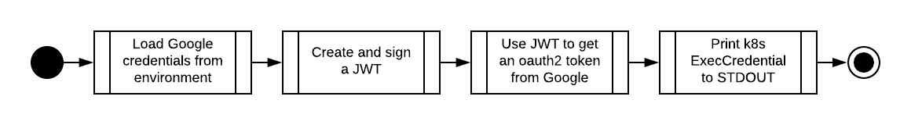

# terraform-kubernetes-credentials-helper
This is a small helper allow terraform-provider-kubernetes to operate without gcloud for managing GKE clusters using GCP credentials.

There are no external dependencies other than golang stdlib bundle. This is a design decision.

## Workflow


## Runtime Dependencies
A variable named GOOGLE_CLOUD_KEY is used by the provider. This variable must be a Google user/SA JSON key.

An easy way to declare such variable is to use `export GOOGLE_CLOUD_KEY=$(cat ${GOOGLE_APPLICATION_CREDENTIALS})` where such other variable is used.

Alternatively, if the credentials for GCP are provided as a variable to the terraform-google-provider, the same variable can be presented in the terraform-kubernetes-provider exec command as in the usage sample.

## Usage
The binary has to be available in the same runtime as terraform.
A variable
The sample below assumes the terraform-kubernetes-provider is being used in the same terraform declaration that creates the cluster being configured. Adjust settings as required.
```terraform
provider kubernetes {
  host = "${google_container_cluster.gke1.endpoint}"
  cluster_ca_certificate = "${base64decode(google_container_cluster.gke1.master_auth.0.cluster_ca_certificate)}"
  exec {
    api_version = "client.authentication.k8s.io/v1beta1"
    command = "./terraform-kubernetes-credentials-helper"
    env = {
      GOOGLE_CLOUD_KEY = "${var.google_creds}"
    }
  }
}
```
## Build Requirements
This build has been tested in go v1.12.7 linux/amd64.
